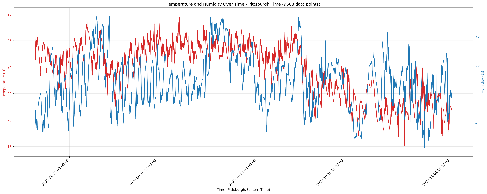

This dataset contains indoor temperature (°C) and humidity (%) measurements collected from a Pittsburgh apartment. The timestamps are recorded in Unix format. Readings were typically sampled every 6 seconds, with the stored values representing the average of 80 mediums out of every 100 samples.

